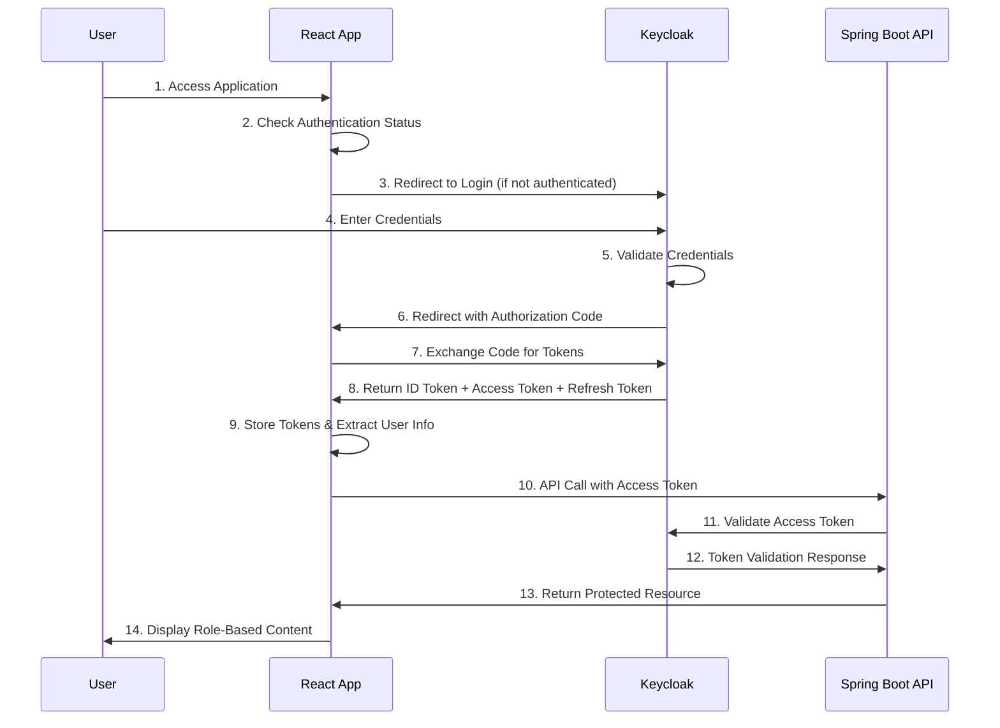
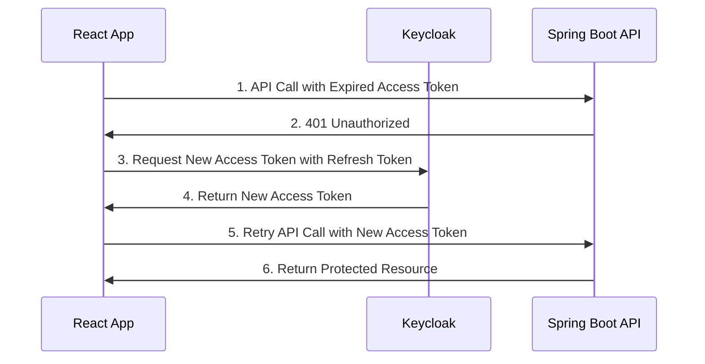

# Keycloak OAuth2 RBAC Demo - Design Document

## Table of Contents
1. [Project Overview](#project-overview)
2. [Architecture Overview](#architecture-overview)
3. [OAuth2 Flow Diagram](#oauth2-flow-diagram)
4. [Component Details](#component-details)
5. [Security Considerations](#security-considerations)
6. [Implementation Plan](#implementation-plan)
7. [Optional Enhancements](#optional-enhancements)

## Project Overview

This project demonstrates how to implement Role-Based Access Control (RBAC) using Keycloak as an identity provider with OAuth2/OpenID Connect, featuring a React frontend and Spring Boot backend.

### Goals
- Test Keycloak's OAuth2 implementation
- Implement RBAC with admin and user roles
- Demonstrate secure token-based authentication
- Create a production-ready authentication flow

### Technology Stack
- **Frontend**: React with Keycloak JavaScript adapter
- **Backend**: Spring Boot with Keycloak integration
- **Identity Provider**: Keycloak (Docker container)
- **Database**: PostgreSQL (for Keycloak data storage)

## Architecture Overview

```

                      Auth/Token Requests 
   ________________________________________________________
   |                                                      |
   |                                                      |
┌─────────────────┐    ┌─────────────────┐    ┌─────────────────┐
│   React App     │────│SpringBoot/Expres│────│   Keycloak      │
│  (OAuth Client) │    │(Resource Server)│    │ (Auth Server)   │
│                 │    │                 │    │                 │
└─────────────────┘    └─────────────────┘    └─────────────────┘
               API Calls w/JWT      Token Validation     |
                                                         │
                                                         │ Direct DB
                                                         │ Access
                                                  ┌─────────────────┐
                                                  │   PostgreSQL    │
                                                  │   (Keycloak DB) │
                                                  │                 │
                                                  └─────────────────┘
```

**Interactions:**
- **React App ↔ Keycloak**: Authentication, token requests, user login/logout
- **React App ↔ Spring Boot**: API calls with JWT tokens attached
- **Spring Boot ↔ Keycloak**: JWT token validation via API endpoints (JWKS, token introspection)
- **Keycloak ↔ PostgreSQL**: Direct database access for user/role/session management
### Directory Structure
keycloak-demo/
├── client/                # Frontend code
├── server/                # Backend code
├── infra/                 # Infrastructure - containers for Auth(Keycloak) and DB(PostgreSQL)
├── README.md              # Main project docs
├── DESIGN.md
├── IMPLEMENTATION_PLAN.md
└── LICENSE

## OAuth2 Flow Diagram

### Authentication Flow



### Token Refresh Flow



## Component Details

### 1. Keycloak (Identity Provider)
**Purpose**: Centralized authentication and authorization server

**Responsibilities**:
- User authentication and credential management
- Role and permission management  
- OAuth2/OIDC token issuance and validation
- User session management

**Configuration**:
- Realm: `keycloak-demo`
- Client: `react-client` (public client for React app)
- Roles: `admin`, `user`
- Users: Test users with different roles

### 2. React Frontend (OAuth Client)
**Purpose**: User interface with role-based access control

**Responsibilities**:
- Handle OAuth2 authentication flow
- Store and manage tokens securely
- Implement role-based UI rendering
- Make authenticated API calls to backend

**Pages/Components**:
- Login page (redirects to Keycloak)
- Admin dashboard (admin role required)
- User dashboard (user role required)
- Logout functionality

### 3. Spring Boot Backend (Resource Server)
**Purpose**: Protected API endpoints with RBAC

**Responsibilities**:
- Validate OAuth2 access tokens
- Enforce role-based access control
- Provide protected resources/APIs
- Handle token introspection

**Endpoints**:
- `GET /api/admin/data` - Admin only
- `GET /api/user/data` - User and Admin
- `GET /api/public/info` - Public access

### 4. PostgreSQL Database
**Purpose**: Store Keycloak configuration and user data

**Responsibilities**:
- Persist Keycloak realms, clients, users, and roles
- Store user sessions and tokens
- Maintain audit logs

## Security Considerations

### Token Management
- **Access Tokens**: Short-lived (15 minutes), used for API authentication
- **ID Tokens**: Used for user identification in frontend
- **Refresh Tokens**: Long-lived, used to obtain new access tokens
- **Token Storage**: In-memory storage preferred, sessionStorage as fallback

### Security Best Practices
- HTTPS in production
- Secure token storage (avoid localStorage for sensitive tokens)
- Token validation on every API request
- Proper CORS configuration
- Secure cookie settings for refresh tokens

### Role-Based Access Control
- **Admin Role**: Full access to all resources
- **User Role**: Limited access to user-specific resources
- **Token Claims**: Roles embedded in JWT tokens
- **Backend Validation**: Role validation on every protected endpoint

## Implementation Plan

Detailed implementation steps can be found here: [IMPLEMENTATION_PLAN.md](./IMPLEMENTATION_PLAN.md).

## High Security Enhancements(Enhancement 1 should be used in production apps)

### Enhancement 1: Advanced Token Management
**Implementation Time**: 1 day

#### Features:
- [ ] Automatic token refresh before expiration
- [ ] Silent token refresh using hidden iframe
- [ ] Token storage in secure HTTP-only cookies
- [ ] Token revocation on logout

#### Implementation Steps:
1. Configure Keycloak for refresh token rotation
2. Implement token refresh interceptor in React
3. Set up secure cookie storage mechanism
4. Add token revocation endpoint calls

### TODO - Optional Enhancements ###
<!-- ### Enhancement 2: Enhanced Security Features
**Implementation Time**: 1-2 days

#### Features:
- [ ] Two-factor authentication (2FA) integration
- [ ] Session timeout with warning
- [ ] Brute force protection
- [ ] Audit logging for security events

#### Implementation Steps:
1. Configure OTP in Keycloak
2. Implement session timeout warnings in React
3. Set up audit logging in Spring Boot
4. Configure Keycloak security policies

### Enhancement 3: Advanced RBAC
**Implementation Time**: 1 day

#### Features:
- [ ] Fine-grained permissions beyond basic roles
- [ ] Dynamic role assignment
- [ ] Resource-based permissions
- [ ] Role hierarchy implementation

#### Implementation Steps:
1. Configure composite roles in Keycloak
2. Implement permission-based guards in React
3. Create permission-based method security in Spring Boot
4. Add dynamic role checking mechanisms

### Enhancement 4: Production Readiness
**Implementation Time**: 2-3 days

#### Features:
- [ ] Environment-specific configurations
- [ ] Health checks and monitoring
- [ ] Error tracking and logging
- [ ] Performance optimization

#### Implementation Steps:
1. Set up environment configurations for dev/staging/prod
2. Implement health check endpoints
3. Add comprehensive logging and monitoring
4. Optimize token caching and API performance
5. Set up CI/CD pipeline
6. Configure production security headers

### Enhancement 5: User Experience Improvements
**Implementation Time**: 1-2 days

#### Features:
- [ ] Loading states and progress indicators
- [ ] Better error messages and user feedback
- [ ] Remember me functionality
- [ ] Mobile responsive design

#### Implementation Steps:
1. Add loading spinners and skeleton screens
2. Implement user-friendly error messages
3. Configure remember me in Keycloak
4. Enhance responsive design and accessibility

## Success Criteria

### Functional Requirements Met:
- [ ] Users can log in through Keycloak
- [ ] Admin users can access admin-only features
- [ ] Regular users can access user features but not admin features
- [ ] Tokens are properly validated and managed
- [ ] Users can log out successfully

### Security Requirements Met:
- [ ] All API endpoints are properly secured
- [ ] Tokens are stored securely
- [ ] Role-based access control is enforced
- [ ] No unauthorized access is possible

### Technical Requirements Met:
- [ ] Infrastructure components run in Docker containers
- [ ] Authentication flow follows OAuth2 standards
- [ ] Code is well-documented and maintainable
- [ ] System is easily deployable and configurable

## Next Steps After Implementation

1. **Performance Optimization**: Monitor and optimize token validation performance
2. **Scalability**: Consider Keycloak clustering for production
3. **Additional Features**: Implement social login, user self-registration
4. **Monitoring**: Set up comprehensive logging and monitoring
5. **Documentation**: Create user guides and API documentation -->
