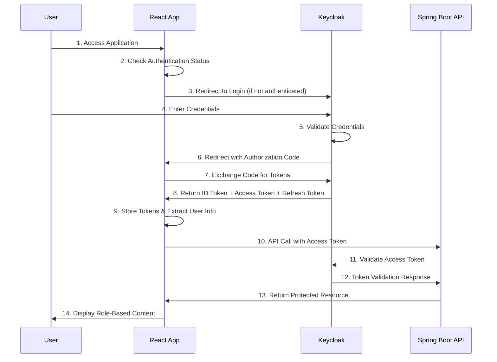
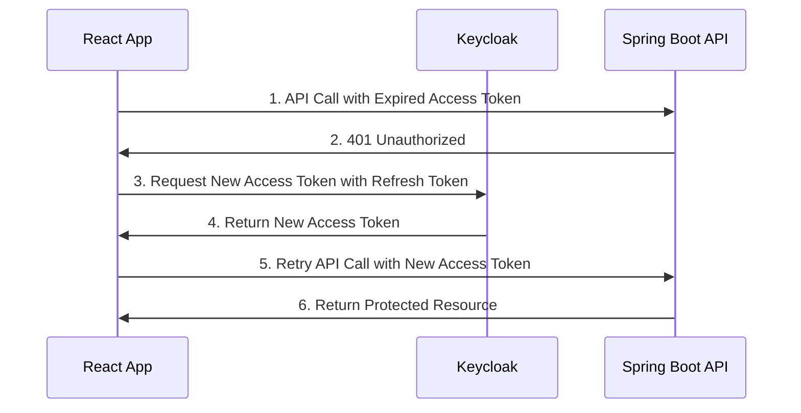

# Iwaizumi Farm Ordering System - Design Document

## Table of Contents
1. [Project Overview](#project-overview)
2. [Architecture Overview](#architecture-overview)
3. [Login System Integration](#login-system-integration)
4. [Component Details](#component-details)
5. [UI/UX Design](#ui-ux-design)
6. [Implementation Plan](#implementation-plan)
7. [Future Enhancements](#future-enhancements)

## Project Overview

This project is the Iwaizumi Farm Ordering System (岩泉ファーム発注システム) - a Japanese farm ordering application with role-based access control using Keycloak authentication, featuring a React frontend and Spring Boot backend.

### Goals
- Convert HTML mock login system to React components
- Integrate Japanese UI with existing Keycloak OAuth2 authentication
- Implement store-code based authentication flow
- Create responsive, accessible Japanese interface
- Maintain existing RBAC with admin and user roles

### Technology Stack
- **Frontend**: React 18 with TypeScript, Tailwind CSS
- **Authentication**: Keycloak JavaScript adapter with OAuth2/OIDC
- **Backend**: Spring Boot with Keycloak integration
- **Identity Provider**: Keycloak (Docker container)
- **Database**: PostgreSQL (for Keycloak data storage)
- **UI Framework**: Custom CSS with Japanese typography support

## Architecture Overview

```
                      Auth/Token Requests 
   ________________________________________________________
   |                                                      |
   |                                                      |
┌─────────────────┐    ┌─────────────────┐    ┌─────────────────┐
│   React App     │────│SpringBoot/Expres│────│   Keycloak      │
│ (Japanese UI)   │    │(Resource Server)│    │ (Auth Server)   │
│ Store Code Auth │    │                 │    │                 │
└─────────────────┘    └─────────────────┘    └─────────────────┘
               API Calls w/JWT      Token Validation     |
                                                         │
                                                         │ Direct DB
                                                         │ Access
                                                  ┌─────────────────┐
                                                  │   PostgreSQL    │
                                                  │   (Keycloak DB) │
                                                  │                 │
                                                  └─────────────────┘
```

**New Login Flow Integration:**
- **Store Code Authentication**: Custom login form captures store code + password
- **Keycloak Integration**: Store credentials mapped to Keycloak users/roles
- **Japanese UI**: All interface elements in Japanese with proper typography
- **Responsive Design**: Mobile-first approach with Japanese text considerations
### Directory Structure
iwaizumi-farm-system/
├── client/                # React frontend with Japanese UI
│   ├── src/
│   │   ├── features/
│   │   │   ├── login/     # Japanese login components
│   │   │   ├── dashboard/ # Farm ordering dashboards
│   │   │   └── common/    # Shared components
│   │   ├── assets/        # Images, fonts for Japanese UI
│   │   └── styles/        # CSS with Japanese typography
├── server/                # Spring Boot backend
├── infra/                 # Keycloak + PostgreSQL containers
├── iwaizumi-mock/         # Original HTML mock (reference)
└── docs/                  # Project documentation

## Login System Integration

### Store Code Authentication Flow

The system uses a two-tier authentication approach:
1. **Custom Login Form**: Japanese interface with store code + password
2. **Keycloak Backend**: OAuth2/OIDC for token management and RBAC

### Store Code Mapping Strategy

**Option A: Direct Keycloak Integration (Recommended)**
- Store codes map directly to Keycloak usernames
- Example: Store code "STORE001" → Keycloak user "STORE001"
- Roles assigned in Keycloak (admin/user based on store type)

**Option B: Custom Authentication Layer**
- Custom backend validates store codes
- Issues Keycloak tokens programmatically
- More complex but allows custom business logic

### User Role Mapping
- **Admin Stores**: Large distribution centers, headquarters
- **User Stores**: Individual retail locations
- **Store Code Format**: Configurable (e.g., "STORE001", "HQ-TOKYO")

## OAuth2 Flow Diagram

### Authentication Flow



### Token Refresh Flow



## Component Details

### 1. Keycloak (Identity Provider)
**Purpose**: Centralized authentication and authorization server

**Responsibilities**:
- User authentication and credential management
- Role and permission management  
- OAuth2/OIDC token issuance and validation
- User session management

**Configuration**:
- Realm: `keycloak-demo`
- Client: `react-client` (public client for React app)
- Roles: `admin`, `user`
- Users: Test users with different roles

### 2. React Frontend (Japanese Farm Ordering UI)
**Purpose**: Japanese farm ordering interface with role-based access control

**Responsibilities**:
- Custom Japanese login form with store code authentication
- Handle OAuth2 authentication flow behind the scenes
- Store and manage tokens securely
- Implement role-based UI rendering for farm operations
- Make authenticated API calls to backend

**Pages/Components**:
- **Login Page**: Japanese interface with store code + password fields
- **Admin Dashboard**: Farm management, store management, order oversight
- **User Dashboard**: Order placement, inventory viewing, store-specific data
- **Navigation**: Japanese menu with role-based items
- **Error Pages**: Japanese error messages and validation

### 3. Spring Boot Backend (Resource Server)
**Purpose**: Protected API endpoints with RBAC

**Responsibilities**:
- Validate OAuth2 access tokens
- Enforce role-based access control
- Provide protected resources/APIs
- Handle token introspection

**Endpoints**:
- `GET /api/admin/data` - Admin only
- `GET /api/user/data` - User and Admin
- `GET /api/public/info` - Public access

### 4. PostgreSQL Database
**Purpose**: Store Keycloak configuration and user data

**Responsibilities**:
- Persist Keycloak realms, clients, users, and roles
- Store user sessions and tokens
- Maintain audit logs
- Store store code mappings and farm-specific data

## UI/UX Design

### Japanese Typography & Styling
- **Font Stack**: "Helvetica Neue", Arial, "Hiragino Kaku Gothic ProN", "Hiragino Sans", Meiryo
- **Color Scheme**: 
  - Primary: `#be9124` (Golden brown - farm theme)
  - Background: `#f0f2f5` (Light gray)
  - Text: `#333333` (Dark gray)
  - Error: `#dc3545` (Red)

### Component Design Principles
- **Mobile-First**: Responsive design starting from 320px width
- **Accessibility**: ARIA labels, keyboard navigation, high contrast
- **Japanese UX**: Right-to-left reading patterns, appropriate spacing
- **Farm Branding**: Cow logo, agricultural color palette

### Key UI Components
1. **Login Form**:
   - Store code input with validation
   - Password field with show/hide toggle
   - Japanese error messages
   - "Forgot password" link
   - Responsive layout (desktop/mobile)

2. **Navigation**:
   - Role-based menu items in Japanese
   - User info display with store code
   - Logout functionality

3. **Dashboards**:
   - Farm-themed layouts
   - Data tables with Japanese headers
   - Action buttons with Japanese labels

## Security Considerations

### Token Management
- **Access Tokens**: Short-lived (15 minutes), used for API authentication
- **ID Tokens**: Used for user identification in frontend
- **Refresh Tokens**: Long-lived, used to obtain new access tokens
- **Token Storage**: In-memory storage preferred, sessionStorage as fallback

### Security Best Practices
- HTTPS in production
- Secure token storage (avoid localStorage for sensitive tokens)
- Token validation on every API request
- Proper CORS configuration
- Secure cookie settings for refresh tokens

### Role-Based Access Control
- **Admin Role**: Full access to all resources
- **User Role**: Limited access to user-specific resources
- **Token Claims**: Roles embedded in JWT tokens
- **Backend Validation**: Role validation on every protected endpoint

## Implementation Plan

Detailed implementation steps can be found here: [IMPLEMENTATION_PLAN.md](./IMPLEMENTATION_PLAN.md).

## High Security Enhancements(Enhancement 1 should be used in production apps)

### Enhancement 1: Advanced Token Management
**Implementation Time**: 1 day

#### Features:
- [ ] Automatic token refresh before expiration
- [ ] Silent token refresh using hidden iframe
- [ ] Token storage in secure HTTP-only cookies
- [ ] Token revocation on logout

#### Implementation Steps:
1. Configure Keycloak for refresh token rotation
2. Implement token refresh interceptor in React
3. Set up secure cookie storage mechanism
4. Add token revocation endpoint calls

### TODO - Optional Enhancements ###
<!-- ### Enhancement 2: Enhanced Security Features
**Implementation Time**: 1-2 days

#### Features:
- [ ] Two-factor authentication (2FA) integration
- [ ] Session timeout with warning
- [ ] Brute force protection
- [ ] Audit logging for security events

#### Implementation Steps:
1. Configure OTP in Keycloak
2. Implement session timeout warnings in React
3. Set up audit logging in Spring Boot
4. Configure Keycloak security policies

### Enhancement 3: Advanced RBAC
**Implementation Time**: 1 day

#### Features:
- [ ] Fine-grained permissions beyond basic roles
- [ ] Dynamic role assignment
- [ ] Resource-based permissions
- [ ] Role hierarchy implementation

#### Implementation Steps:
1. Configure composite roles in Keycloak
2. Implement permission-based guards in React
3. Create permission-based method security in Spring Boot
4. Add dynamic role checking mechanisms

### Enhancement 4: Production Readiness
**Implementation Time**: 2-3 days

#### Features:
- [ ] Environment-specific configurations
- [ ] Health checks and monitoring
- [ ] Error tracking and logging
- [ ] Performance optimization

#### Implementation Steps:
1. Set up environment configurations for dev/staging/prod
2. Implement health check endpoints
3. Add comprehensive logging and monitoring
4. Optimize token caching and API performance
5. Set up CI/CD pipeline
6. Configure production security headers

### Enhancement 5: User Experience Improvements
**Implementation Time**: 1-2 days

#### Features:
- [ ] Loading states and progress indicators
- [ ] Better error messages and user feedback
- [ ] Remember me functionality
- [ ] Mobile responsive design

#### Implementation Steps:
1. Add loading spinners and skeleton screens
2. Implement user-friendly error messages
3. Configure remember me in Keycloak
4. Enhance responsive design and accessibility

## Success Criteria

### Functional Requirements Met:
- [ ] Users can log in through Keycloak
- [ ] Admin users can access admin-only features
- [ ] Regular users can access user features but not admin features
- [ ] Tokens are properly validated and managed
- [ ] Users can log out successfully

### Security Requirements Met:
- [ ] All API endpoints are properly secured
- [ ] Tokens are stored securely
- [ ] Role-based access control is enforced
- [ ] No unauthorized access is possible

### Technical Requirements Met:
- [ ] Infrastructure components run in Docker containers
- [ ] Authentication flow follows OAuth2 standards
- [ ] Code is well-documented and maintainable
- [ ] System is easily deployable and configurable

## Next Steps After Implementation

1. **Performance Optimization**: Monitor and optimize token validation performance
2. **Scalability**: Consider Keycloak clustering for production
3. **Additional Features**: Implement social login, user self-registration
4. **Monitoring**: Set up comprehensive logging and monitoring
5. **Documentation**: Create user guides and API documentation -->
